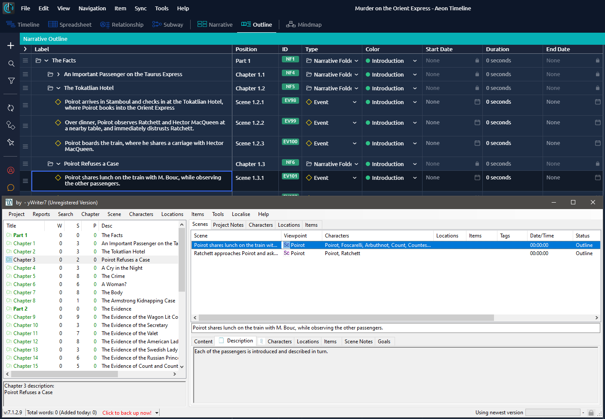

[yWriter](http://spacejock.com/yWriter7.html) is a free word processor written by Australian author and programmer Simon Haynes. yWriter's strengths are structuring novels and controlling the progress during the writing process. With the *aeon2yw* Python script, you can convert a novel outline created with Aeon Timeline 3 into a new yWriter project.

## Features

- The release comes with a template for Aeon Timeline 3 that provides a suitable narrative folder structure and a "Viewpoint" character role.
- The aeon3yw Python script read the *.aeon* project file and generates a new yWriter project from it.
- Alternatively, it converts Aeon's csv export into a new yWriter project.
- Events belonging to the narrative structure are converted to yWriter scenes.
- Chapters are created according to the "Narrative Folder" structure.
- Events not belonging to the narrative structure are converted to "Notes" scenes and placed in a "Notes" chapter.
- Parts are converted into empty chapters that begin a new section in yWriter.
- The scenes have a start time and a duration, if the year is between 100 and 9999.
- Characters, locations and items are imported, if any.
- Scene descriptions and scene notes are imported, if any.
- Scene tags are imported, if any.

 
## Requirements

- [Python 3.6+](https://www.python.org). 
- [Aeon Timeline 3](https://www.aeontimeline.com/). Note: There is a separate [converter for Aeon Timeline 2](https://peter88213.github.io/aeon2yw).

## Download and install

[Download the latest release (version 0.7.3)](https://raw.githubusercontent.com/peter88213/aeon3yw/main/dist/aeon3yw_v0.7.3.zip)

- Unzip the downloaded zipfile "aeon3yw_v0.7.3.zip" into a new folder.
- Move into this new folder and launch **setup.pyw**. This installs the script for the local user.
- Create a shortcut on the desktop when asked.
- Start Aeon Timeline 3 and import the "yWriter" template from the "sample" folder.
- Open "README.md" for usage instructions.

### Note for Linux users

Please make sure that your Python3 installation has the *tkinter* module. On Ubuntu, for example, it is not available out of the box and must be installed via a separate package. 

------------------------------------------------------------------

[Changelog](changelog)

## Usage

See the [instructions for use](usage)

## Credits

- Frederik Lundh published the [xml pretty print algorithm](http://effbot.org/zone/element-lib.htm#prettyprint).

## License

aeon3yw is distributed under the [MIT License](http://www.opensource.org/licenses/mit-license.php).

 

